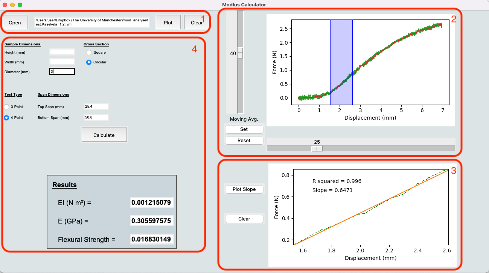

# modulus_gui
A GUI for calculating Bending rigidity, Flexural Young’s modulus and Bending strength of beams from force/displacement data collected during 3 and 4 point bending. 

## GUI functionality: 

1. Allows user to load data from a text file and plot the raw data (green lines on upper plot). 

2. Sliders allow user to smooth both Force and Displacement data using a moving average. Once smoothing is at desired level the “Set” button locks in smoothing (red line on upper plot). The “Reset” removes smoothing and re-plots original data.When smoothing is set a left click on mouse allows the user to select the area of the graph that they which to analyse. For Young’s modulus this is the initial linear region of the Force/Displacement curve (highlighted in blue). 

3. The “Plot” button then plots the selected area on the lower plot and regression analysis is used to plot a line of best fit and the slope and R-squared of that line are displayed on the lower panel. 

4. The slope is then used with the sample dimensions and rig dimensions to calculate rigidity (EI), flexural Young’s modulus (E) and flexural strength. Using equations from Ennos (2012). 

## References 

Ennos, A. R. (2012). Solid Biomechanics. New Jersey: Princeton University Press.
